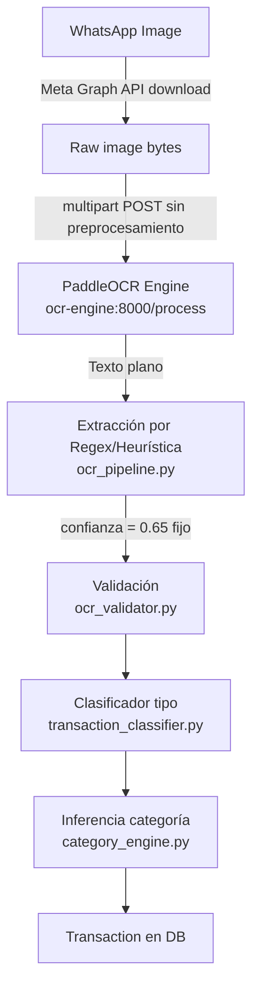

# Análisis: Sistema de Detección de Imágenes IA

## Hallazgo Crítico — El 65% es una constante hardcodeada

El problema principal no es que el modelo tenga 65% de confianza real. **El valor 0.65 es un número fijo que nunca cambia**, sin importar qué tan bien o mal se extrajo la información del comprobante:

```119:119:backend/core/services/ocr_pipeline.py
"confianza": 0.65,
```

Nunca se evalúa la calidad real de la extracción. El sistema actualmente no tiene confianza real — tiene una etiqueta estática.

---

## Arquitectura actual del pipeline



---

## Los 9 problemas identificados

### Problema 1: Confianza hardcodeada — no existe confianza real
**Archivos:** [`backend/core/services/ocr_pipeline.py`](backend/core/services/ocr_pipeline.py) (línea 119)

La confianza debería calcularse dinámicamente según cuántos campos se extrajeron correctamente, si el monto vino del patrón primario o del fallback, si se identificó la entidad específica, etc. Actualmente es imposible saber si una extracción fue buena o mala porque siempre reporta lo mismo.

El flujo completo confirma que el `0.65` se propaga sin cambio: `_extract_receipt_fields` lo pone en el dict → `validate_ocr_response` lo clampea entre 0 y 1 (sigue siendo 0.65) → `TransactionService.create_from_ocr` lo lee con `ocr_data.get('confianza', 0.0)` y lo guarda en la columna `confianza_ia` de la DB.

---

### Problema 2: Cero preprocesamiento de imagen antes del OCR
**Archivos:** [`backend/core/services/ocr_local.py`](backend/core/services/ocr_local.py) (líneas 33-37)

Las imágenes de WhatsApp llegan comprimidas, con posibles rotaciones, baja resolución o fondos con glare. Se envían crudas al motor PaddleOCR sin ningún tratamiento:

```python
payload = bytearray(image_bytes)
image_stream = io.BytesIO(payload)
# Sin resize, sin grayscale, sin contraste, sin corrección de rotación
```

WhatsApp aplica compresión JPEG agresiva especialmente en imágenes enviadas como foto (no como documento). Esto degrada directamente la calidad del texto que PaddleOCR puede leer.

El motor OCR en `server.py` también convierte a RGB con PIL pero no aplica ningún preprocesamiento antes de pasar el array a `ocr.ocr(img_array)`.

---

### Problema 3: Patrones regex frágiles, sin diferenciación por entidad
**Archivos:** [`backend/core/services/ocr_pipeline.py`](backend/core/services/ocr_pipeline.py) (líneas 124-178)

- El monto usa un fallback de "número más grande en el texto", lo que puede capturar el número de referencia o teléfono en lugar del monto.
- La referencia bancaria solo captura 6–15 caracteres alfanuméricos, puede fallar en referencias más largas o de formato diferente.
- Nequi, Daviplata y Bancolombia tienen layouts de comprobante distintos, pero todos usan los mismos regex genéricos.
- `_looks_like_receipt` puede rechazar comprobantes válidos de entidades no listadas (ej: Banco de Bogotá, Davivienda, PSE).

La detección de entidad usa `any(x in lowered for x in [...])` con frases genéricas como "pago exitoso" que podrían aparecer en cualquier texto, no solo en comprobantes de esa entidad.

---

### Problema 4: El validador penaliza sin retroalimentar confianza
**Archivos:** [`backend/core/services/ocr_validator.py`](backend/core/services/ocr_validator.py) (líneas 30-96)

Si falta `referencia_bancaria`, el pipeline devuelve error y no guarda nada. Pero si el monto se extrajo correctamente y solo faltó la referencia (campo menos crítico para el usuario), el resultado útil se descarta. Además los errores no reducen la confianza — simplemente eliminan la transacción.

El validador tiene el esquema `OCR_SCHEMA` con `referencia_bancaria: required: True` pero en la práctica muchos comprobantes válidos (especialmente Nequi) no exponen la referencia en pantalla de forma estandarizada.

---

### Problema 5: `use_angle_cls` removido del motor activo *(confirmado en servidor)*
**Archivos:** [`ai_ocr_service/server.py`](ai_ocr_service/server.py)

La versión anterior del motor (`server.py.save`) tenía `use_angle_cls=True` y `cpu_threads=4`. La versión activa los eliminó, probablemente para estabilizar el contenedor Docker. La configuración real del motor en producción es:

```python
ocr = PaddleOCR(
    lang="es",
    use_gpu=False,
    enable_mkldnn=False,
    ocr_version='PP-OCRv4',
    show_log=False
)
```

Sin `use_angle_cls`, el modelo no detecta ni corrige la orientación del texto. Comprobantes fotografiados con inclinación mayor a ~15° devuelven texto ilegible o vacío. Esta es la razón más probable detrás de fallos silenciosos donde el OCR responde pero devuelve 0 líneas.

**Lo que SÍ está correctamente configurado:** PP-OCRv4 ✅, idioma español ✅, CPU puro ✅, mkldnn deshabilitado para compatibilidad Docker ✅.

**Lo que NO está configurado:** `use_angle_cls`, `cpu_threads`, `det_db_thresh`, `rec_batch_num`.

---

### Problema 6: `_to_numeric_string` destruye valores con decimales *(nuevo)*
**Archivos:** [`backend/core/services/ocr_pipeline.py`](backend/core/services/ocr_pipeline.py) (línea ~175)

La función elimina todos los caracteres no numéricos sin distinguir separadores de miles de separadores decimales:

```python
def _to_numeric_string(raw_value: str):
    digits = re.sub(r"[^0-9]", "", raw_value)
    return digits if digits else None
```

Ejemplos de comportamiento:
- `"$ 50.000"` → `"50000"` — correcto
- `"1.200.000"` → `"1200000"` — correcto
- `"1.200.000,50"` → `"120000050"` — **incorrecto** (debería ser `1200000`)
- `"50,000"` → `"50000"` — ambiguo (¿50 mil o 50 COP con decimales?)

En la práctica los comprobantes colombianos rara vez muestran centavos, pero si el OCR lee el monto con coma decimal (formato estándar colombiano `1.200.000,00`), el valor persistido en DB es **100 veces el real**.

---

### Problema 7: Circuit breaker no funciona con múltiples workers de Gunicorn *(nuevo)*
**Archivos:** [`backend/core/services/circuit_breaker.py`](backend/core/services/circuit_breaker.py)

El `OCRCircuitBreaker` es un singleton en memoria Python instanciado al importar el módulo:

```python
ocr_breaker = OCRCircuitBreaker()  # singleton de módulo
```

Con `gunicorn --workers 3` hay **3 procesos separados**, cada uno con su propia instancia del circuit breaker en memoria. Los contadores de fallo no se comparten. Para abrir el circuito se necesitan `failure_threshold × workers = 5 × 3 = 15` requests fallidos (en el peor caso). Al hacer rolling restart de cualquier worker, el contador se resetea a 0. El circuit breaker actualmente no protege contra cascadas de fallos reales.

---

### Problema 8: Bug de migración — `updated_at` nunca se actualiza *(nuevo)*
**Archivos:** [`backend/transactions/migrations/0001_initial.py`](backend/transactions/migrations/0001_initial.py)

```python
# En la migración (bug):
('updated_at', models.DateTimeField(auto_now_add=True))

# En el modelo Django (correcto):
updated_at = models.DateTimeField(auto_now=True)
```

`auto_now_add=True` escribe la fecha únicamente al crear el registro, nunca al actualizar. Cuando el usuario confirma o rechaza una transacción (`transaction.estado = 'confirmed'`; `transaction.save(...)`), la columna `updated_at` en la DB mantiene el valor de creación. Hay un desync entre el modelo Django y el schema real de la base de datos.

---

### Problema 9: Procesamiento OCR síncrono dentro del webhook de Meta *(nuevo)*
**Archivos:** [`backend/whatsapp/views.py`](backend/whatsapp/views.py), [`backend/whatsapp/message_handler.py`](backend/whatsapp/message_handler.py)

Meta requiere que el webhook responda `200 OK` en menos de 20 segundos, o lo marca como caído y reintenta el delivery. El pipeline completo (descarga de imagen de Meta API + timeout OCR de hasta 35s) se ejecuta **dentro del request HTTP** de forma síncrona:

```python
def receive_message(request):
    # ...
    handle_incoming_message(...)  # puede tardar hasta 35+ segundos
    return HttpResponse('OK', status=200)
```

Si el OCR está bajo carga y tarda los 35s máximos, Meta reintenta el mensaje. El constraint `UNIQUE` en `referencia_bancaria` bloquea la inserción duplicada a nivel DB, pero el usuario recibirá el mensaje de confirmación dos veces y la segunda llamada al OCR consume recursos innecesariamente.

---

## Configuración real del sistema (datos del servidor)

### Motor OCR (`ai_ocr_service/`)

| Parámetro | Estado | Valor |
|-----------|--------|-------|
| `ocr_version` | Configurado | `PP-OCRv4` |
| `lang` | Configurado | `"es"` |
| `use_gpu` | Configurado | `False` |
| `enable_mkldnn` | Configurado | `False` |
| `use_angle_cls` | **Ausente** | — (solo en `server.py.save` con `True`) |
| `cpu_threads` | **Ausente** | — (solo en `server.py.save` con `4`) |
| `det_db_thresh` | **Ausente** | — |
| `rec_batch_num` | **Ausente** | — |

Flags de entorno pre-Paddle (en `server.py` y en `docker-compose.yml`):
- `FLAGS_enable_pir_api=0`, `FLAGS_enable_new_ir_api=0` — deshabilita el nuevo motor PIR de Paddle 2.6 (fix para crash en Docker)
- `FLAGS_use_mkldnn=0` — deshabilita oneDNN
- `FLAGS_eager_delete_scope=True` — libera memoria agresivamente
- `FLAGS_allocator_strategy=naive_best_fit` (solo en compose) — estrategia de allocación de memoria
- `PADDLE_PDX_DISABLE_MODEL_SOURCE_CHECK=True` (solo en compose)

### Docker Compose

- Memoria límite OCR container: **3.5 GB** (sin límite de CPU — puede saturar el host)
- Modelos PaddleOCR persistidos en host: `/opt/finanzas-backend/ai-models:/root/.paddleocr` (no se redescargan en cada rebuild)
- Source mount del OCR service: `/opt/finanzas-backend/ai_ocr_service:/app` (cambios en `server.py` aplican sin rebuild)
- Backend depende de `ocr-engine` con health check (`curl /health`, cada 30s, start_period 60s)
- Gunicorn: 3 workers, timeout 120s

### Dependencias exactas (OCR service)

| Paquete | Versión |
|---------|---------|
| `paddlepaddle` | `2.6.2` (fijada) |
| `paddleocr` | `2.7.3` (fijada) |
| `numpy` | `<2.0.0` (restringida) |
| `Pillow` | Sin pinear — versión más reciente al momento del build |
| `opencv-python` | No declarada — llega transitivamente desde `paddleocr` |

### Análisis del Category Engine y Transaction Classifier

**`category_engine.py`:** Scoring basado en longitud de keyword (keywords más largos suman más puntos al score). Umbral mínimo `score >= 3`. El sistema es puramente keyword matching sin ML. Limitación principal: no reconoce nombres propios de personas como destinatarios (el caso más común en transferencias P2P colombianas) — todas caen en `sin_categorizar`.

**`transaction_classifier.py`:** Usa `SequenceMatcher` con umbral `0.7` de similitud para detectar transferencias propias y clasificar ingresos. Riesgo: usuarios con nombres cortos o genéricos (ej: "Ana", "Luis") pueden tener ratio > 0.7 contra destinatarios como "Ana García" o "Luis Torres", causando clasificaciones incorrectas.

---

## Hallazgo histórico: migración de Gemini a PaddleOCR

La migración `0003` de Django renombra el campo `raw_gemini_response` → `raw_ocr_response` en la tabla `transactions_transaction`. El sistema originalmente extraía datos de comprobantes usando **Gemini AI** (Google). Fue migrado a PaddleOCR local. El archivo `.env` activo aún contiene `GEMINI_API_KEY` pero no tiene uso activo en el pipeline OCR actual.

---

## Resumen de oportunidades de mejora

- **Confianza real calculada:** Score basado en campos extraídos, calidad del patrón usado, entidad identificada vs "otro", monto encontrado con patrón primario vs fallback.
- **Preprocesamiento de imagen:** Upscaling, conversión a grayscale, aumento de contraste/sharpening con Pillow o OpenCV antes de enviar al OCR — aplicable tanto en `ocr_local.py` como en `server.py`.
- **Restaurar `use_angle_cls=True`:** Evaluar si el crash original fue resuelto con los flags de entorno actuales. Si es estable, reactivarlo en `server.py` para manejar imágenes rotadas.
- **Agregar `cpu_threads=4`:** Estaba en `server.py.save` — mejora el throughput del modelo en CPU.
- **Regex por entidad:** Patrones específicos para el layout de Nequi, Daviplata y Bancolombia, con fallback a genérico.
- **Validación flexible:** Hacer `referencia_bancaria` opcional (o generar una interna con hash de monto+fecha+entidad) para no perder transacciones con monto válido.
- **Corregir `_to_numeric_string`:** Detectar si el separador final es decimal o de miles antes de eliminar caracteres.
- **Circuit breaker compartido:** Usar Django cache (memcached/redis) o un archivo/DB para compartir el estado del circuit breaker entre los 3 workers de Gunicorn.
- **Corregir migración `updated_at`:** Generar una migración `AlterField` que cambie `auto_now_add=True` a `auto_now=True`.
- **Webhook asíncrono:** Encolar el procesamiento OCR con Celery (o similar) y responder `200 OK` a Meta inmediatamente, eliminando el riesgo de retries por timeout.
- **Pinear Pillow en OCR Dockerfile:** Agregar versión explícita (`Pillow==10.x.x`) para builds reproducibles.
- **Logging de calidad:** Registrar qué campos fallaron por imagen para poder identificar patrones y mejorar iterativamente.
